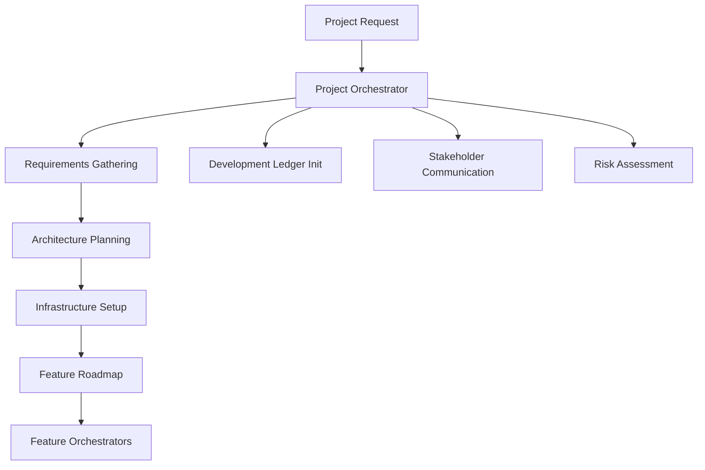
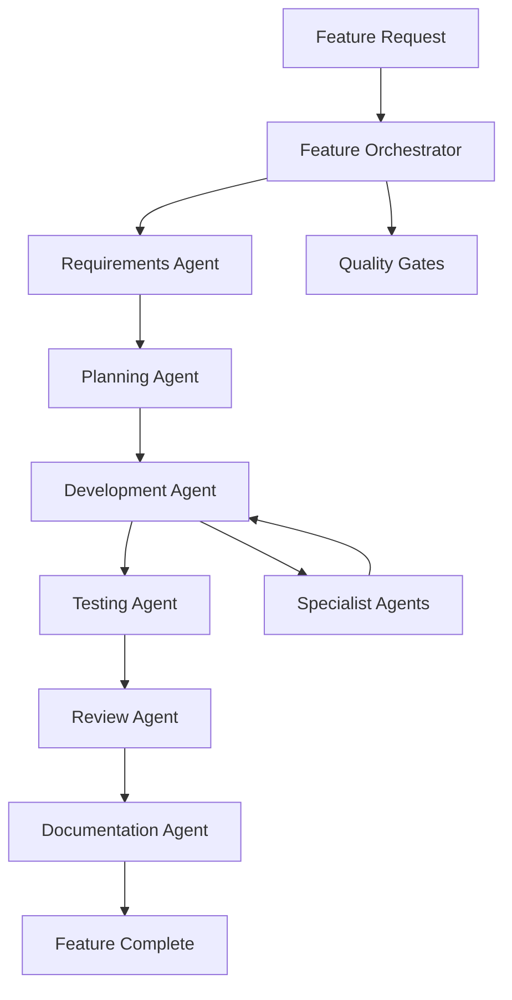
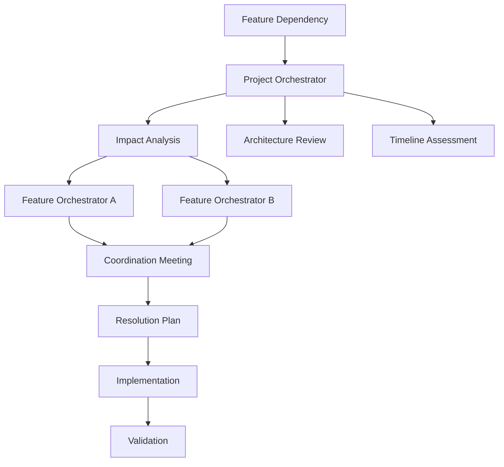

# Agent Orchestration System Guide

## Overview

The Agent Orchestration System provides a comprehensive framework for managing complex software development projects using specialized AI agents. This three-tier system ensures coordinated development from project inception through production deployment and ongoing maintenance.

## Architecture Overview

### Three-Tier Orchestration Structure

```
┌─────────────────────────────────────────────────────────────────┐
│                    PROJECT ORCHESTRATOR                        │
│  • Project lifecycle management                                │
│  • Cross-feature coordination                                  │
│  • Development ledger maintenance                              │
│  • Stakeholder communication                                   │
└─────────────────────┬───────────────────────────────────────────┘
                      │
┌─────────────────────┼───────────────────────────────────────────┐
│              FEATURE ORCHESTRATORS                              │
│  • Individual feature lifecycle management                     │
│  • Agent coordination within feature scope                     │
│  • Quality gate enforcement                                    │
│  • Feature-specific progress tracking                          │
└─────────────────────┼───────────────────────────────────────────┘
                      │
┌─────────────────────┼───────────────────────────────────────────┐
│                WORKFLOW AGENTS                                  │
│  01-requirements-agent    04-testing-agent                     │
│  02-planning-agent        05-review-agent                      │
│  03-development-agent     06-documentation-agent               │
└─────────────────────────────────────────────────────────────────┘
```

### Integration with Existing Specialist Agents

The orchestration system coordinates your existing specialist agents:

- `backend-architect` - System architecture and API design
- `dotnet-data-specialist` - Data access and Entity Framework
- `csharp-developer` - C# implementation and best practices
- `blazor-developer` - Blazor components and UI implementation
- `dotnet-security-specialist` - Security implementation and validation
- `blazor-accessibility-performance-specialist` - Accessibility and performance
- `supportability-lifecycle-specialist` - Operations and monitoring
- `documentation-specialist` - Technical writing and documentation
- `ui-design-specialist` - UI/UX design and styling

## When to Use Each Orchestration Level

### Project Orchestrator

**Use When:**

- Starting a new project or major initiative
- Transitioning between project phases (Requirements → Architecture → Development)
- Managing cross-feature dependencies and conflicts
- Making project-wide architectural or technology decisions
- Coordinating major milestones and stakeholder communication
- Managing resource allocation across multiple features
- Escalating feature-level issues that affect project timeline or scope

**Examples:**

```
"I'm starting a new customer portal project with user authentication, dashboard, and reporting features. Help me coordinate the initial project setup and feature planning."

"We're transitioning from the architecture phase to development phase for our inventory management system. Coordinate the development environment setup and feature implementation planning."

"Feature A and Feature B have conflicting API requirements that affect our system architecture. Help resolve this cross-feature dependency."
```

### Feature Orchestrator

**Use When:**

- Starting development of a specific feature or user story
- Coordinating multiple specialist agents for feature implementation
- Managing feature-specific quality gates and testing
- Handling feature integration with existing system components
- Tracking feature progress and resolving feature-level blockers
- Managing feature deployment and rollout

**Examples:**

```
"I need to implement a user authentication feature including login, registration, password reset, and session management. Coordinate the specialist agents to deliver this feature."

"We're building a real-time collaboration feature that involves SignalR, database changes, and new UI components. Orchestrate the implementation across all required specialists."

"The reporting feature is ready for comprehensive testing and review. Coordinate the testing, security review, and documentation activities."
```

### Workflow Agents

**Use When:**

- Specific workflow phases need focused attention
- Requirements need clarification or validation
- Implementation planning and task breakdown is required
- Development coordination across multiple specialists is needed
- Comprehensive testing strategy and execution is required
- Systematic review processes need orchestration
- Documentation coordination and quality assurance is needed

**Examples:**

```
"The requirements for our notification system are unclear. Use the requirements-agent to clarify the scope and acceptance criteria."

"I have validated requirements for the audit logging feature. Use the planning-agent to create a detailed implementation plan."

"Implementation is complete for the user profile feature. Use the testing-agent to coordinate comprehensive testing across all quality dimensions."
```

## Orchestration Workflows

### Project Kickoff Workflow



**Steps:**

1. **Project Initialization** (Project Orchestrator)

   - Stakeholder identification
   - High-level requirements gathering
   - Project scope definition
   - Resource assessment

2. **Requirements & Architecture** (Project Orchestrator + Specialists)

   - Detailed requirements analysis
   - System architecture design
   - Technology stack selection
   - Integration planning

3. **Infrastructure & Setup** (Project Orchestrator + Specialists)

   - Development environment setup
   - CI/CD pipeline configuration
   - Monitoring and observability setup
   - Security framework implementation

4. **Feature Planning** (Project Orchestrator → Feature Orchestrators)
   - Feature prioritization and roadmap
   - Cross-feature dependency mapping
   - Resource allocation planning
   - Risk assessment and mitigation

### Feature Development Workflow



**Steps:**

1. **Feature Analysis** (Feature Orchestrator → Requirements Agent)

   - Requirement clarification and validation
   - Acceptance criteria refinement
   - Edge case identification
   - Stakeholder alignment

2. **Implementation Planning** (Planning Agent)

   - Technical design and architecture
   - Task breakdown and estimation
   - Resource allocation and scheduling
   - Risk assessment and mitigation

3. **Development Coordination** (Development Agent + Specialists)

   - Implementation orchestration
   - Code integration management
   - Quality standard enforcement
   - Progress tracking and reporting

4. **Quality Assurance** (Testing Agent + Review Agent)

   - Comprehensive testing strategy
   - Multi-dimensional quality validation
   - Code and architecture reviews
   - Security and performance validation

5. **Knowledge Management** (Documentation Agent)
   - Technical documentation creation
   - User guide development
   - Operational runbook creation
   - Knowledge transfer facilitation

### Cross-Feature Coordination Workflow



## Usage Examples

### Starting a New Project

```markdown
Prompt for Project Orchestrator:
"I'm starting a new e-commerce platform project with the following high-level requirements:

- User authentication and profiles
- Product catalog and search
- Shopping cart and checkout
- Order management
- Admin dashboard
- Integration with payment processors

Business objectives:

- Support 10,000 concurrent users
- Sub-200ms response times
- WCAG 2.1 AA accessibility
- PCI DSS compliance for payments
- Mobile-responsive design

Constraints:

- 6-month timeline
- Team of 5 developers
- Must integrate with existing customer database
- Azure cloud deployment

Please coordinate the project initialization, requirements gathering, and feature planning."
```

### Implementing a Specific Feature

```markdown
Prompt for Feature Orchestrator:
"I need to implement a user authentication feature with the following requirements:

- Email/password login
- Social login (Google, Microsoft)
- Multi-factor authentication (TOTP)
- Password reset functionality
- Session management
- Role-based permissions
- Account lockout protection
- Audit logging

Technical constraints:

- ASP.NET Core Identity
- Blazor Server UI
- SQL Server database
- Integration with existing user profiles
- WCAG 2.1 AA compliance
- Performance: <500ms login time

Please coordinate the specialist agents to deliver this feature including planning, implementation, testing, and documentation."
```

### Requirements Clarification

```markdown
Prompt for Requirements Agent:
"I have the following requirements for a reporting feature that need clarification:

'Users should be able to generate reports on their data with various filters and export options.'

This requirement is too vague. Please help me clarify:

- What types of reports are needed?
- What data should be included?
- What filter options are required?
- What export formats are needed?
- Who can access which reports?
- Are there performance requirements?
- Are there scheduling or automation needs?

Business context:

- Multi-tenant application
- Users manage ontology data
- Need both summary and detailed reports
- Compliance requirements may apply"
```

### Implementation Planning

```markdown
Prompt for Planning Agent:
"I have validated requirements for a real-time collaboration feature and need a detailed implementation plan:

Requirements:

- Multiple users can edit the same ontology simultaneously
- Real-time cursor positions and selections
- Conflict resolution for concurrent edits
- User presence indicators
- Edit history and undo/redo
- Permissions-based editing controls

Technical specifications:

- SignalR for real-time communication
- Operational Transform for conflict resolution
- Blazor Server with real-time UI updates
- Entity Framework for persistence
- Redis for session state
- Performance target: <100ms edit propagation

Please create a comprehensive implementation plan with task breakdown, effort estimates, risk assessment, and agent coordination strategy."
```

## Best Practices

### Orchestration Guidelines

1. **Start at the Right Level**

   - Use Project Orchestrator for cross-feature coordination
   - Use Feature Orchestrator for complete feature development
   - Use Workflow Agents for specific phase focus

2. **Provide Complete Context**

   - Include business objectives and constraints
   - Specify technical requirements and limitations
   - Identify stakeholders and success criteria
   - Document known risks and dependencies

3. **Maintain Development Ledger**

   - Keep the ledger updated through orchestration
   - Document decisions and their rationale
   - Track feature progress and issues
   - Maintain architectural evolution history

4. **Coordinate Quality Gates**

   - Define quality standards at project level
   - Enforce standards through feature orchestration
   - Use workflow agents for systematic validation
   - Escalate quality issues appropriately

5. **Manage Dependencies Proactively**
   - Identify dependencies early in planning
   - Use Project Orchestrator for cross-feature conflicts
   - Coordinate timing and interface agreements
   - Monitor and adjust for dependency changes

### Communication Patterns

1. **Regular Status Updates**

   - Daily progress summaries from Feature Orchestrators
   - Weekly project summaries from Project Orchestrator
   - Milestone reports for stakeholder communication
   - Issue escalation as needed

2. **Decision Documentation**

   - Document all significant decisions
   - Include alternatives considered and rationale
   - Update Architecture Decision Records (ADRs)
   - Communicate decisions to affected teams

3. **Knowledge Sharing**
   - Share lessons learned across features
   - Document best practices and patterns
   - Facilitate knowledge transfer between agents
   - Maintain institutional knowledge in ledger

## Integration with Development Ledger

### Automated Ledger Updates

The orchestration system automatically maintains the Development Ledger:

- **Project Orchestrator**: Updates project status, cross-feature decisions, milestone progress
- **Feature Orchestrators**: Updates feature progress, quality gates, completion status
- **Workflow Agents**: Updates phase completion, quality metrics, lessons learned

### Ledger Structure

```markdown
# Development Ledger (Orchestration-Enhanced)

## Current Status (Auto-updated by Project Orchestrator)

**Phase**: [Current project phase]
**Active Features**: [Features in development]
**Project Health**: [Overall project health assessment]
**Next Milestone**: [Upcoming milestone and date]

## Feature Coordination (Updated by Feature Orchestrators)

### Feature: [Feature Name]

- **Orchestration Status**: [Orchestration phase]
- **Agent Coordination**: [Specialist agents involved and status]
- **Quality Gates**: [Quality gate status]
- **Integration Status**: [Cross-feature integration status]

## Decision Log (Enhanced with Orchestration Context)

### [Date] - [Decision Title]

- **Orchestration Level**: Project/Feature/Workflow
- **Coordinating Agent**: [Which orchestrator managed decision]
- **Specialist Input**: [Which specialists provided input]
- **Cross-Feature Impact**: [Impact on other features]

## Quality Coordination (Updated by Workflow Agents)

### Testing Coordination

- **Multi-Feature Testing**: [Cross-feature test coordination]
- **Quality Gate Enforcement**: [Systematic quality validation]
- **Performance Testing**: [System-wide performance validation]

### Review Coordination

- **Architecture Reviews**: [System-wide architecture validation]
- **Security Reviews**: [Cross-cutting security validation]
- **Code Reviews**: [Code quality and consistency validation]
```

## Troubleshooting Common Issues

### When to Escalate Between Levels

1. **Feature Orchestrator → Project Orchestrator**

   - Cross-feature dependencies or conflicts
   - Resource conflicts affecting multiple features
   - Timeline risks affecting project milestones
   - Architectural decisions with system-wide impact

2. **Workflow Agent → Feature Orchestrator**

   - Quality gates not meeting standards despite multiple attempts
   - Resource needs exceeding workflow agent scope
   - Cross-specialist coordination challenges
   - Timeline risks affecting feature delivery

3. **Specialist Agent → Workflow Agent**
   - Complex technical decisions requiring broader context
   - Integration challenges with other specialists
   - Quality standard questions or conflicts
   - Resource or skill gap limitations

### Common Orchestration Challenges

1. **Over-Orchestration**

   - **Problem**: Using orchestrators for simple, single-specialist tasks
   - **Solution**: Use specialist agents directly for straightforward tasks

2. **Under-Orchestration**

   - **Problem**: Attempting complex multi-agent coordination without orchestration
   - **Solution**: Use appropriate orchestration level for coordination needs

3. **Context Loss**

   - **Problem**: Important context not preserved between orchestration phases
   - **Solution**: Maintain comprehensive context in Development Ledger

4. **Quality Gate Bypassing**
   - **Problem**: Pressure to skip quality validation for speed
   - **Solution**: Use orchestration to enforce systematic quality processes

This orchestration system transforms your existing agent-based development approach from manual coordination to intelligent orchestration, ensuring better outcomes, reduced coordination overhead, and more predictable delivery while maintaining the deep expertise of your specialist agents.
